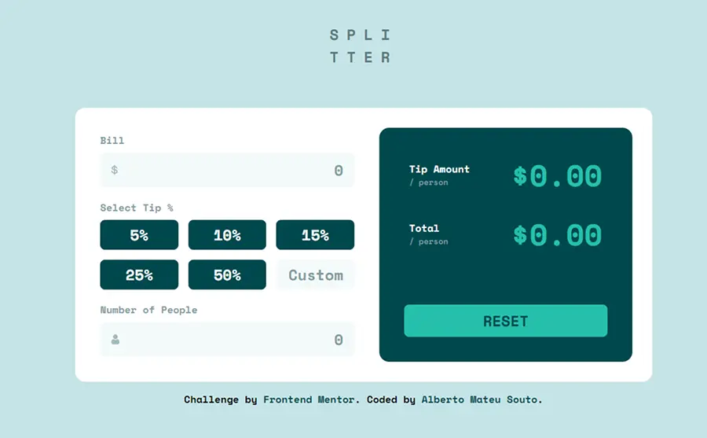

# Frontend Mentor - Solución de la aplicación de calculadora de propinas

Esta es una solución al [reto de la aplicación de calculadora de propinas en Frontend Mentor](https://www.frontendmentor.io/challenges/tip-calculator-app-ugJNGbJUX). Los retos de Frontend Mentor ayudan a mejorar las habilidades de programación construyendo proyectos realistas.

## Tabla de contenido

- [Vista general](#vista-general)
  - [El reto](#el-reto)
  - [Captura de pantalla](#captura-de-pantalla)
  - [Enlaces](#enlaces)
- [Mi proceso](#mi-proceso)
  - [Construido con](#construido-con)
  - [Lo que aprendí](#lo-que-aprendí)
  - [Desarrollo futuro](#desarrollo-futuro)
  - [Recursos útiles](#recursos-útiles)
  - [Colaboración con IA](#colaboración-con-ia)
- [Autor](#autor)

## Vista general

### El reto

Los usuarios deben poder:

- Ver el diseño óptimo de la aplicación según el tamaño de la pantalla de su dispositivo.
- Ver los estados de *hover* y *focus* para todos los elementos interactivos de la página.
- Calcular la propina correcta y el costo total de la factura por persona.
- Ver mensajes de error dinámicos y advertencias visuales (bordes rojos y alertas) si el número de personas se establece en cero, se deja vacío o se introduce un número negativo.
- Interactuar plenamente con la aplicación de forma accesible utilizando lectores de pantalla y navegación por teclado.

### Captura de pantalla

### Enlaces

- URL del sitio en vivo: [Añadir URL del sitio en vivo aquí](https://your-live-site-url.com)

## Mi proceso

### Construido con

- Marcado HTML5 semántico
- Propiedades personalizadas de CSS (Variables)
- Flexbox y CSS Grid
- Enfoque *Mobile-first* (Primero móviles)
- JavaScript nativo (Vanilla JavaScript ES6+)
- Buenas prácticas de accesibilidad (`aria-pressed`, `aria-live`, `role="alert"`)

### Lo que aprendí

Durante este proyecto he podido afianzar varios aspectos clave del desarrollo frontend moderno:

- **Mejoras en la accesibilidad HTML:** Integración de atributos ARIA avanzados (`aria-pressed`, `aria-label`, `aria-live="polite"` y `role="alert"`) para garantizar una experiencia totalmente inclusiva con lectores de pantalla.
- **Mejoras en la estructura del CSS:** Organización modular utilizando variables globales, diseño adaptable con CSS Grid y Flexbox, y el uso de unidades relativas para lograr un diseño responsivo fluido y limpio.
- **Práctica del correcto uso del DOM en JavaScript:** Centralización de la lógica en funciones reutilizables, gestión eficiente de eventos y una validación robusta de formularios que evita errores comunes (como los resultados `NaN` o la gestión de entradas vacías y negativas).

### Desarrollo futuro

En futuros proyectos, quiero seguir profundizando en los estándares de accesibilidad web (a11y), explorando patrones avanzados de maquetación en CSS y perfeccionando las estructuras de gestión de estado en JavaScript nativo antes de dar el salto definitivo a frameworks basados en componentes como React.

### Recursos útiles

- [MDN Web Docs](https://developer.mozilla.org/) - Referencia esencial para métodos de arrays en JavaScript, eventos del DOM y atributos ARIA.

### Colaboración con IA

Durante este proyecto, la Inteligencia Artificial se utilizó como un asistente de programación y a modo de aprendizaje para areas como accesibilidad:
- **Herramientas utilizadas:** Gemini.
- **Cómo se usó:** Lluvia de ideas para la elección de la arquitectura, depuración de conflictos en los *event listeners*, mejora de la gestión de casos límite en las validaciones (como evitar el `NaN` y gestionar los valores por defecto de los inputs) y la integración de buenas prácticas de accesibilidad web (`aria-pressed`, `aria-live="polite"` y `role="alert"`).
- **Qué funcionó bien:** El proceso de resolución de errores iterativo me permitió refactorizar el código de manera limpia para conseguir una estructura más profesional y escalable, aprendiendo al mismo tiempo las mejores prácticas de accesibilidad.

## Autor

- Frontend Mentor - [@amateusouto](https://www.frontendmentor.io/profile/amateusouto)
- GitHub - [amateusouto](https://github.com/amateusouto)